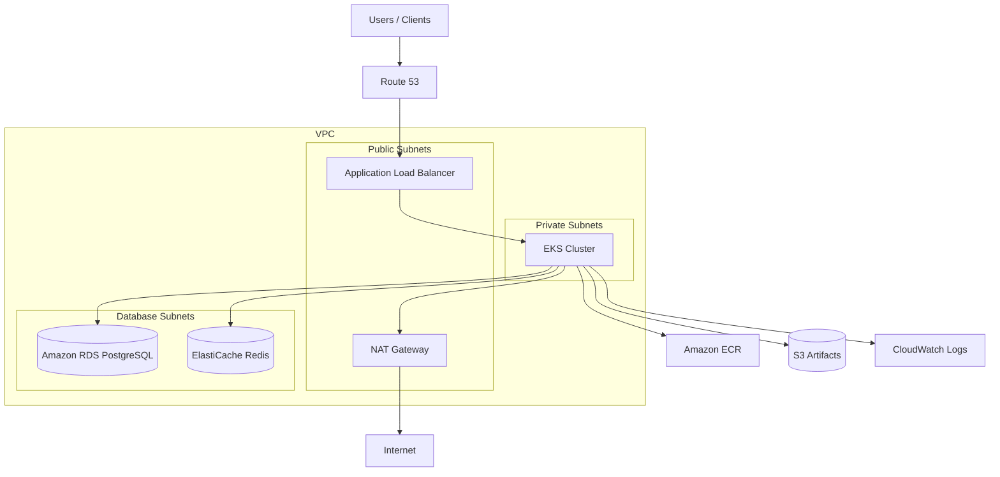

# AI DevOps Kubernetes Agent Infrastructure

Terraform implementation of a production-style AWS architecture for running containerized AI/DevOps agent workloads on **Amazon EKS**.

> **Note:** The original architecture diagram was not available in this session. This stack implements a standard three-tier Kubernetes reference architecture commonly used for agent/API platforms. If your diagram differs, share it and the modules can be adjusted.

## Architecture



## Components

| Layer | AWS Service | Purpose |
|-------|-------------|---------|
| Network | VPC, IGW, NAT | Isolated networking across 3 AZs |
| Compute | **EKS + managed node groups** | Kubernetes workloads (agent API/worker) |
| Ingress | ALB | Public HTTP/HTTPS entry point |
| Data | RDS PostgreSQL | Persistent relational storage |
| Cache | ElastiCache Redis | Session/cache layer |
| Registry | ECR | Container image storage |
| Storage | S3 | Artifacts, models, ALB access logs |
| Security | IAM / IRSA, Secrets Manager | Least-privilege pod and DB credentials |
| DNS | Route 53 (optional) | Custom domain alias to ALB |

## Repository Layout

```
terraform/
  modules/
    vpc/           # VPC, subnets, NAT, routing
    eks/           # EKS cluster, node groups, IRSA roles
    alb/           # Application Load Balancer
    rds/           # PostgreSQL + Secrets Manager
    elasticache/   # Redis replication group
    ecr/           # Container registries
    s3/            # Artifacts and logs buckets
  environments/
    dev/           # Dev environment root module
kubernetes/
  aws-load-balancer-controller-values.yaml
  target-group-binding.yaml
```

## Prerequisites

- Terraform >= 1.5
- AWS CLI configured with permissions to create VPC, EKS, RDS, ElastiCache, ALB, IAM, and S3 resources
- `kubectl` and `helm` for post-deploy Kubernetes setup

## Deploy

```bash
cd terraform/environments/dev
cp terraform.tfvars.example terraform.tfvars
# Edit terraform.tfvars for your account/region

terraform init
terraform plan
terraform apply
```

## Post-Deploy Kubernetes Setup

1. Configure `kubectl`:

```bash
aws eks update-kubeconfig --region <region> --name <cluster-name>
```

2. Install the AWS Load Balancer Controller (optional if using the Terraform-managed ALB with TargetGroupBinding):

```bash
helm repo add eks https://aws.github.io/eks-charts
helm repo update

helm upgrade --install aws-load-balancer-controller eks/aws-load-balancer-controller \
  -n kube-system \
  -f ../../kubernetes/aws-load-balancer-controller-values.yaml
```

3. Bind your service to the Terraform-created target group:

```bash
# Replace placeholders in kubernetes/target-group-binding.yaml
kubectl apply -f ../../kubernetes/target-group-binding.yaml
```

## Key Outputs

After `terraform apply`, useful outputs include:

- `eks_cluster_name` / `configure_kubectl`
- `alb_dns_name` / `application_url`
- `ecr_repository_urls`
- `rds_credentials_secret_arn`
- `app_service_account_role_arn`

## Customization

Common changes in `terraform/environments/dev/terraform.tfvars`:

- `domain_name` + `acm_certificate_arn` for HTTPS and custom DNS
- `node_instance_types`, `node_desired_size` for compute sizing
- `single_nat_gateway = false` for HA NAT in production
- `ecr_repository_names` for additional services

## Assumptions

Because the source diagram was unavailable, this implementation assumes:

1. EKS runs in **private subnets**; ALB is in **public subnets**
2. PostgreSQL and Redis live in **database subnets**
3. Workloads pull images from **ECR**
4. Application artifacts are stored in **S3**
5. Pod IAM permissions use **IRSA**

If your diagram includes additional services (API Gateway, SQS, Bedrock, WAF, etc.), open an issue or share the diagram for extension.

## Cost Notes

This stack creates billable resources including NAT Gateway, EKS control plane, EC2 worker nodes, RDS, and ElastiCache. Use `terraform destroy` in non-production environments when finished.

## License

See [LICENSE](LICENSE).
