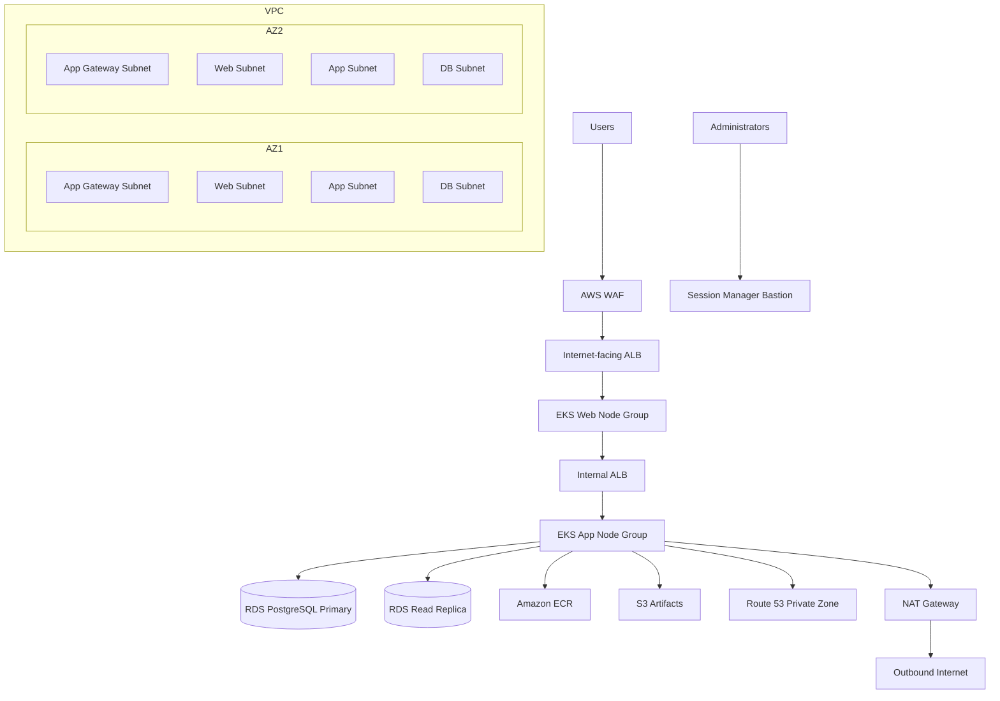

# AI DevOps Kubernetes Agent Infrastructure

Terraform implementation of the **Tech Tutorials With Piyush** multi-tier Azure architecture, replicated on AWS with **Amazon EKS** replacing the Docker VMSS compute tiers.

## Azure → AWS mapping

| Azure (diagram) | AWS (this repo) |
|-----------------|-----------------|
| Resource Group | Tagged project resources |
| Virtual Network | VPC (`10.0.0.0/16`) |
| App Gateway Subnet + App Gateway + WAF + Public IP | Dedicated appgateway subnets + internet-facing ALB + **AWS WAF** |
| Web Tier NSG + Public Subnets + VMSS (Docker) | Security groups + public web subnets + **EKS web node group** |
| Internal Load Balancers | **Internal ALB** in private app subnets |
| App Tier NSG + Private Subnets + VMSS (Docker) | Security groups + private app subnets + **EKS app node group** |
| Private DNS Zone | **Route 53 private hosted zone** (`internal.local`) |
| DB Tier + PostgreSQL Primary / Read Replica | Database subnets + **RDS PostgreSQL** primary + read replica |
| Bastion Subnet + Azure Bastion | Bastion subnet + **Session Manager bastion** + SSM VPC endpoints |
| Key Vault | **KMS** + **Secrets Manager** |
| Container Registry | **Amazon ECR** |
| NAT Gateway + Public IP | **NAT Gateway** for private subnet egress |

## Architecture



## Repository layout

```
terraform/
  modules/
    vpc/           # Tiered subnets: appgateway, web, app, db, bastion
    eks/           # EKS with separate web and app node groups
    alb/           # Public and internal load balancers
    waf/           # AWS WAF on the public ALB
    rds/           # PostgreSQL primary + read replica
    ecr/           # Container registry
    s3/            # Artifacts and logs buckets
    kms/           # Encryption key (Key Vault equivalent)
    bastion/       # Session Manager host + SSM endpoints
    private-dns/   # Internal service discovery
  environments/
    dev/           # Ready-to-deploy root module
kubernetes/
  aws-load-balancer-controller-values.yaml
  web-target-group-binding.yaml
  app-target-group-binding.yaml
```

## Prerequisites

- Terraform >= 1.5
- AWS CLI with permissions for VPC, EKS, RDS, ALB, WAF, IAM, Route 53, KMS, and S3
- `kubectl` and `helm` for post-deploy Kubernetes setup

## Deploy

```bash
cd terraform/environments/dev
cp terraform.tfvars.example terraform.tfvars
terraform init
terraform plan
terraform apply
```

## Post-deploy

1. Configure `kubectl`:

```bash
aws eks update-kubeconfig --region <region> --name <cluster-name>
```

2. Create namespaces and deploy web/app workloads with node selectors `tier: web` and `tier: app`.

3. Bind services to the Terraform-created target groups:

```bash
kubectl apply -f ../../kubernetes/web-target-group-binding.yaml
kubectl apply -f ../../kubernetes/app-target-group-binding.yaml
```

4. Access the bastion host via Session Manager:

```bash
aws ssm start-session --target <bastion-instance-id>
```

## Key outputs

- `public_alb_dns_name` — public entry point (App Gateway equivalent)
- `internal_api_fqdn` — private DNS name for the app API (`api.internal.local`)
- `eks_cluster_name` / `configure_kubectl`
- `ecr_repository_urls`
- `rds_primary_endpoint` / `rds_replica_endpoint`
- `bastion_instance_id`

## Customization

Edit `terraform/environments/dev/terraform.tfvars`:

- `domain_name` + `acm_certificate_arn` for HTTPS and custom public DNS
- `web_*` and `app_*` sizing for each EKS node group
- `create_read_replica = false` to disable the read replica
- `single_nat_gateway = false` for HA NAT in production

## Cost notes

This stack creates billable resources including NAT Gateway, EKS control plane, EC2 nodes, RDS, ALB, and WAF. Use `terraform destroy` in non-production environments when finished.

## License

See [LICENSE](LICENSE).
